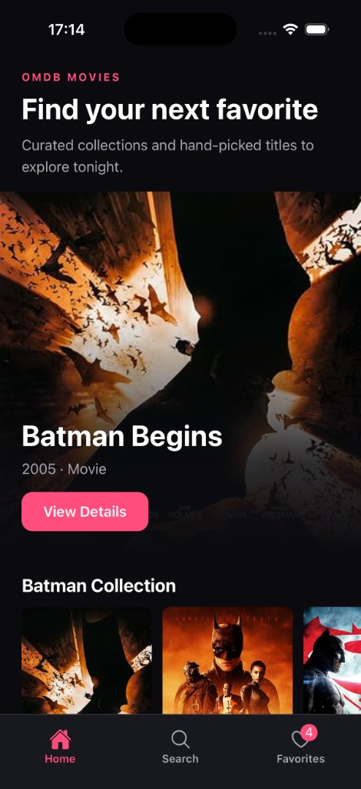
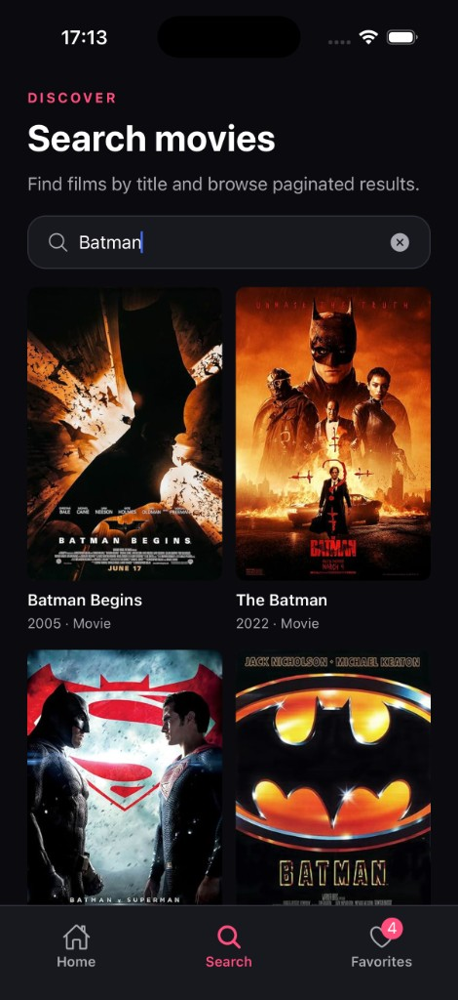
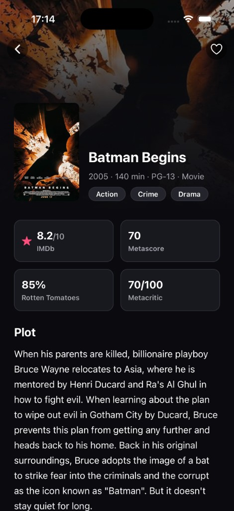
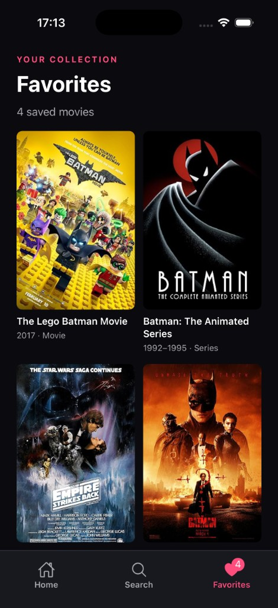

# OMDb Movies (React Native)

Expo React Native movie browsing app powered by the OMDb API.

Built with **Expo SDK 54**, **React Navigation**, **TanStack Query**, and **AsyncStorage** for favorites.

## Screenshots

| Home | Search |
| :---: | :---: |
|  |  |

| Details | Favorites |
| :---: | :---: |
|  |  |

## Features

- **Home** — curated OMDb collections, featured title, and an explore grid
- **Search** — debounced title search with infinite pagination
- **Movie details** — poster, metadata, ratings, plot, cast/crew facts, favorite toggle
- **Favorites** — persisted watchlist with tab badge count, empty/error/loading states
- **Resilience** — loading skeletons, empty states, and recoverable error UI across screens

## Architecture

Code is organized by product feature, not by technical layer:

| Area | Responsibility |
| --- | --- |
| `src/app/` | Navigation + app providers (`QueryProvider`, `FavoritesProvider`) |
| `src/features/movies/` | OMDb API, domain mapping, Home/Details UI + hooks |
| `src/features/search/` | Search screen orchestration (`useSearchScreen`) + search UI |
| `src/features/favorites/` | Context, reducer, AsyncStorage persistence, Favorites screen |
| `src/shared/` | Domain-neutral theme, hooks, `AppHeader`, `StateMessage` |

Useful entry points:

- `App.tsx` — root composition
- `src/app/navigation/` — tabs + stack routes
- `src/features/movies/api/` — HTTP client, DTOs, errors, TanStack Query keys
- `src/features/movies/domain/` — mappers/selectors (API shape stays out of UI)
- `src/features/favorites/context/FavoritesProvider.tsx` — favorites state + persistence

Screens stay thin: they wire hooks/context into UI. Data fetching and business rules live in hooks/domain modules.

## Notable decisions

- **TanStack Query + `movieKeys`** — cache keys are centralized so search/details/home stay consistent and invalidatable.
- **DTO → domain mapping** — OMDb responses are normalized before UI use (`N/A` posters, ratings, people lists, etc.).
- **Debounced search** — input updates immediately; the query waits so typing does not spam OMDb.
- **Custom details header** — Movie Details uses `AppHeader` instead of native stack `headerRight`, because iOS glass / bar-button layout made the favorite control unreliable.
- **Favorites hydration merge** — toggles update memory/UI immediately; storage hydrate merges with in-session adds so a fast first tap is not wiped by a late load.
- **`shared/` stays domain-neutral** — movie/search/favorites-specific code stays in features, even when reused across tabs.

## Reviewer checklist

1. Add an OMDb key and run `npm start` (simulator or Expo Go on the same Wi-Fi).
2. Confirm Home loads collections and opens a movie details screen.
3. Search for a title (e.g. `Batman`), scroll to load more pages, clear the input.
4. Favorite a movie from details; confirm the Favorites tab badge updates.
5. Background/kill the app and reopen — favorites should still be there.
6. Optional quality pass: `npm run lint && npm test && npx tsc --noEmit`.

## Known limitations

- Depends on OMDb availability / free-tier rate limits.
- Targets **Expo SDK 54** (matches current store Expo Go).
- No authentication or multi-device sync — favorites are local to the device.
- Home collections are curated search terms, not a personalized feed.

## Prerequisites

- Node.js 20+ (Node 24 recommended for running tests)
- npm
- [Expo Go](https://expo.dev/go) on a physical device, **or** Xcode (iOS Simulator) / Android Studio (emulator)

## Setup

1. Install dependencies:

```bash
npm install
```

2. Create your environment file in the **project root** (same folder as `package.json`):

```bash
cp .env.example .env
```

The file must be named exactly `.env` (not `.env.local` or similar). Expo only loads `EXPO_PUBLIC_*` variables from this root `.env` file into the app.

3. Open `.env` and set your OMDb API key using this exact variable name:

```bash
EXPO_PUBLIC_OMDB_API_KEY=your_api_key_here
```

Get a free key at [omdbapi.com/apikey.aspx](https://www.omdbapi.com/apikey.aspx).

Do not commit `.env` — it is gitignored. `.env.example` is safe to commit and shows the required key name without a real secret.

If you change `.env` while Metro is already running, restart the bundler so the new value is picked up:

```bash
npm start -- --clear
```

## Development

Start the Metro bundler from the project root:

```bash
npm start
```

Then press:

- `i` — open iOS Simulator
- `a` — open Android Emulator
- `w` — open web

Other useful commands while the dev server is running:

- `r` — reload the app
- `m` — open the developer menu

### Hot reload (Fast Refresh)

Fast Refresh is enabled by default in development. Save a file and the app should update without a full restart.

If changes are not appearing:

1. Open the developer menu (`Cmd + D` in iOS Simulator, `Cmd + M` in Android Emulator)
2. Ensure **Enable Fast Refresh** is turned on
3. Restart Metro with a clean cache:

```bash
npm start -- --clear
```

### Running on a physical device with Expo Go

This project uses **Expo SDK 54**, which matches the current Expo Go app on the App Store and Play Store.

1. Install [Expo Go](https://expo.dev/go) on your phone
2. Connect your phone and computer to the **same Wi-Fi network**  
   Expo Go loads the app over your local network by default. If the devices are on different networks (or on a restricted public Wi-Fi), the QR code connection usually fails.
3. From the project root, run `npm start` and scan the QR code from the terminal or Expo Dev Tools
4. If LAN connection still fails, start with tunnel mode instead:

```bash
npx expo start --tunnel
```

Tunnel is slower, but works when devices cannot reach each other on the local network.

Alternatively, run a native build on a connected device:

```bash
npm run ios -- --device
# or
npm run android
```

## Scripts

| Command                 | Description                    |
| ----------------------- | ------------------------------ |
| `npm start`             | Start Expo dev server          |
| `npm run ios`           | Run on iOS                     |
| `npm run android`       | Run on Android                 |
| `npm run web`           | Run in the browser             |
| `npm run lint`          | Run ESLint                     |
| `npm test`              | Run Jest test suite            |
| `npm run test:watch`    | Run tests in watch mode        |
| `npm run test:coverage` | Run tests with coverage report |

## Quality checks

```bash
npm run lint
npm test
npm run test:watch
npm run test:coverage
npx tsc --noEmit
npx tsc --noEmit -p tests/tsconfig.json
```

### Linting

`npm run lint` runs ESLint using the Expo flat config in `eslint.config.js`.

### Testing

Tests live under the top-level `tests/` directory, organized by responsibility:

- `tests/unit/` — pure domain logic (mappers, selectors, view models, storage)
- `tests/components/` — component behavior and accessibility
- `tests/integration/` — screen-level flows with focused mocks
- `tests/fixtures/` — deterministic test data
- `tests/mocks/` — reusable module mocks
- `tests/utilities/` — shared render helpers

Pure domain logic is tested directly. Component tests focus on public behavior and accessibility rather than implementation details.

The integration-style `MovieDetailsScreen` test mocks the movie API at the module boundary and verifies loading, rendering, and favorites toggling without real network requests.

## Project structure

```text
.env.example        Example env vars (copy to .env in this same root folder)
App.tsx             App entry point
docs/screenshots/   App UI screenshots used in this README
src/
  app/              Navigation and app-level providers
  features/
    movies/         Home, movie details, OMDb API integration
    search/         Search screen and UI
    favorites/      Favorites context, storage, and screens
  shared/           Theme, hooks, AppHeader, and shared components
tests/              Jest test suites
```
